# Use Cases

This document expands the user stories in [02 User Stories](./02%20User%20Stories.md) into concrete scenarios. Each use case describes the actor, the expected outcome, the normal flow, and an illustrative Mermaid diagram.

## Shared actors and terms

- **User**: collector, thinker, or explorer using Kiritori.
- **Note**: a unit of text, media, citation, or a combination of these.
- **Collection**: a flexible area of relevance that can contain many notes.
- **Connection**: an explicit relationship, or “door”, between notes and collections.
- **Forest**: the complete local network of notes, collections, and connections.

## UC-01 - Create a note through a connection

**Related story:** Story 1

**Actor:** Thinker  
**Goal:** Save a new note with meaningful context.  
**Precondition:** The user is viewing the forest or an existing connection.

**Main scenario:**
1. The user chooses **Create note** from an existing connection.
2. Kiritori displays the selected context and nearby notes.
3. The user writes the note and optionally adds another connection.
4. The user saves the note.
5. Kiritori stores the note and shows it in every related context.

**Alternative:** If no suitable connection exists, the user creates a new connection before saving.

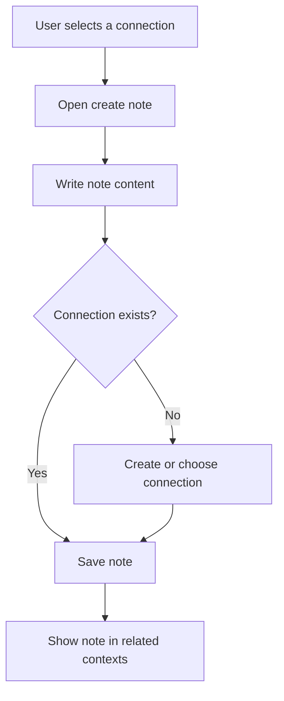

## UC-02 - Capture a quick thought

**Related story:** Story 2

**Actor:** User  
**Goal:** Preserve an idea quickly without interrupting thought.  
**Precondition:** Kiritori is open.

**Main scenario:**
1. The user opens quick capture.
2. The user enters a short thought or attaches an image.
3. Kiritori suggests nearby connections or collections.
4. The user accepts a suggestion or chooses one manually.
5. Kiritori saves the capture for later editing.

**Alternative:** If the user cannot decide immediately, the capture is saved in a clearly marked review queue rather than silently becoming an orphan.

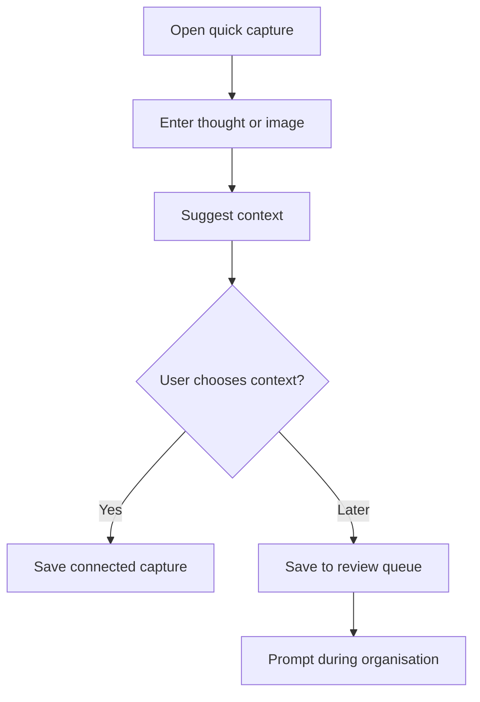

## UC-03 - Add multimodal content

**Related story:** Story 3

**Actor:** User  
**Goal:** Keep text, images, and references together in one note.  
**Precondition:** A note draft exists.

**Main scenario:**
1. The user writes text in the note editor.
2. The user attaches an image or citation.
3. Kiritori validates and stores each attachment locally.
4. The user reviews the combined note.
5. The user saves it to its connection.

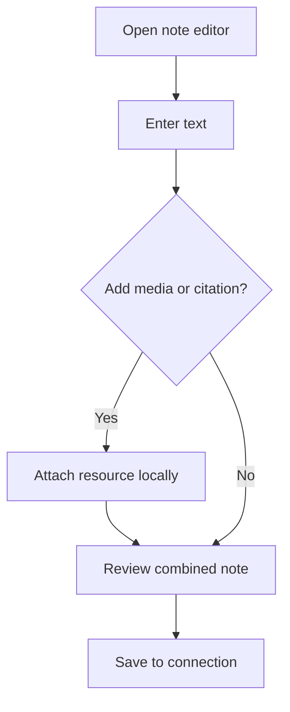

## UC-04 - Review imported notes

**Related story:** Story 4

**Actor:** Collector  
**Goal:** Understand imported material before organising it.  
**Precondition:** One or more notes have been imported.

**Main scenario:**
1. The user opens **Waiting to be organised**.
2. Kiritori displays imported notes without a collection.
3. The user previews a note and its source information.
4. The user assigns a collection or connection.
5. Kiritori removes the note from the review queue.

**Alternative:** The user selects several notes and assigns them in one bulk action.

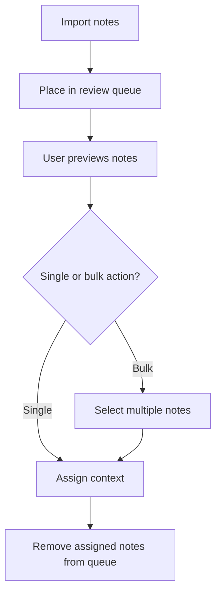

## UC-05 - Reorganise an existing note

**Related story:** Story 5

**Actor:** User  
**Goal:** Move a note as their understanding changes.  
**Precondition:** The note already exists.

**Main scenario:**
1. The user opens the note’s context editor.
2. The user adds, removes, or changes a collection or connection.
3. Kiritori previews the resulting relationships.
4. The user confirms the change.
5. Related views update immediately.

**Alternative:** The user selects undo to restore the previous placement.

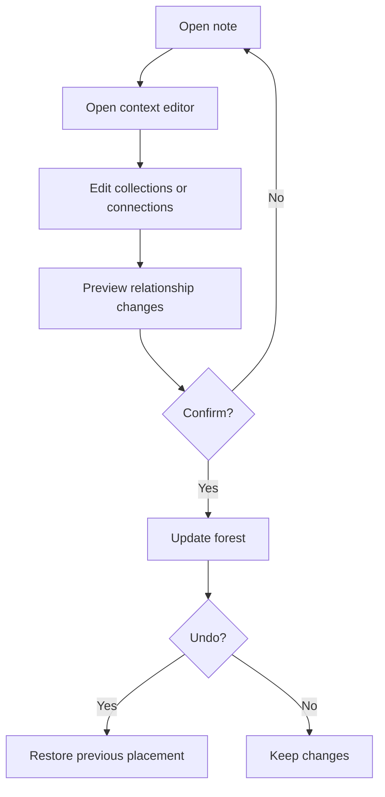

## UC-06 - Change the library view

**Related story:** Story 6

**Actor:** User  
**Goal:** Move between a dense overview and detailed note review.  
**Precondition:** The forest contains notes.

**Main scenario:**
1. The user opens the library.
2. The user zooms or changes the grouping.
3. Kiritori changes the visible level of detail.
4. The user filters by collection, connection, date, or media type.
5. The user opens an individual note when needed.

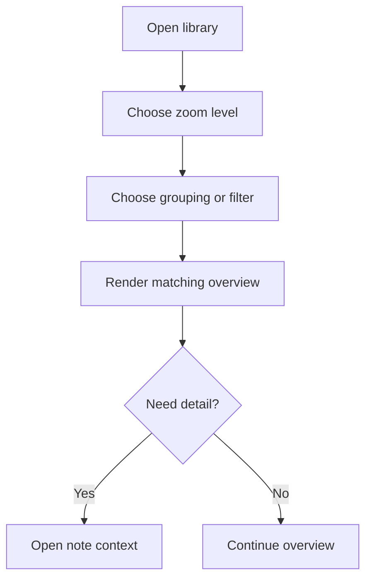

## UC-07 - Discover a relationship

**Related story:** Story 7

**Actor:** Explorer  
**Goal:** Find relationships that were not explicitly planned.  
**Precondition:** The forest contains multiple related items.

**Main scenario:**
1. The user opens a note or collection.
2. Kiritori displays direct and suggested related items.
3. The user inspects the reason for a suggested relationship.
4. The user follows a relationship or creates an explicit connection.

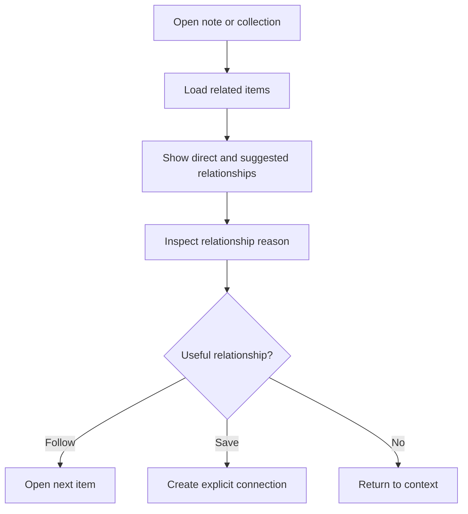

## UC-08 - Roam through neighbouring ideas

**Related story:** Story 8

**Actor:** Explorer  
**Goal:** Browse without starting from a specific task.  
**Precondition:** The forest contains connected notes.

**Main scenario:**
1. The user starts roaming mode.
2. Kiritori presents a small set of neighbouring ideas.
3. The user opens one item.
4. Kiritori presents the next set from the new context.
5. The user exits roaming or saves an interesting note.

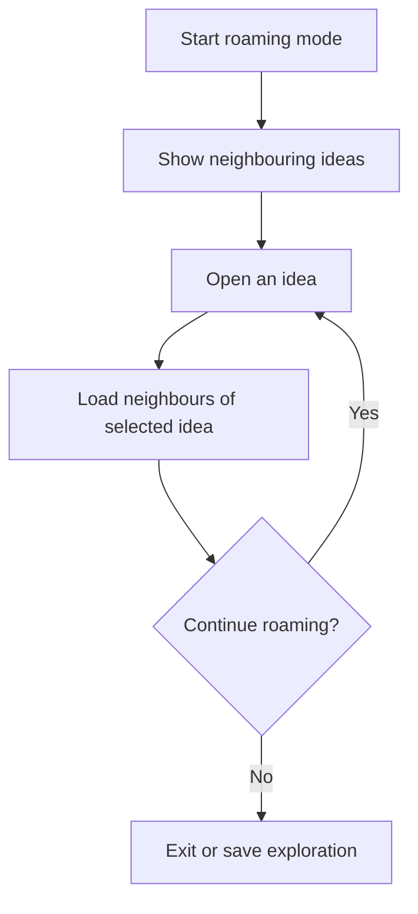

## UC-09 - Follow a trail of thought

**Related story:** Story 9

**Actor:** Thinker  
**Goal:** Understand how one idea leads to another.  
**Precondition:** At least two connected items exist.

**Main scenario:**
1. The user selects a starting note.
2. The user chooses **Follow trail**.
3. Kiritori displays connected items in sequence.
4. The user expands a step to inspect its reason.
5. The user saves the trail or returns to the starting note.

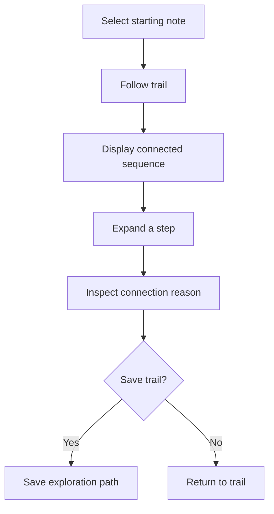

## UC-10 - Build a collection

**Related story:** Story 10

**Actor:** User  
**Goal:** Create a flexible area of relevance.  
**Precondition:** The user is in the library or collection view.

**Main scenario:**
1. The user chooses **New collection**.
2. The user enters a name and optional description.
3. The user adds existing notes.
4. Kiritori creates the collection without forcing a hierarchy.
5. The collection appears wherever its notes are shown.

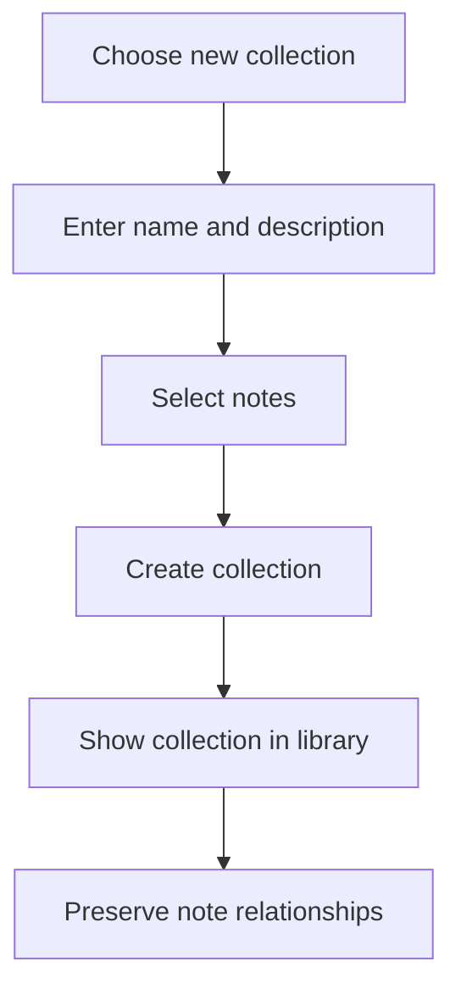

## UC-11 - Save and export a citation

**Related story:** Story 11

**Actor:** Researcher  
**Goal:** Preserve source context and take it elsewhere when needed.  
**Precondition:** A note or imported source is open.

**Main scenario:**
1. The user opens citation details.
2. The user enters or reviews title, authors, date, and source notes.
3. Kiritori stores the citation locally.
4. The citation is linked to the relevant note or collection.
5. The user optionally exports the reference data.

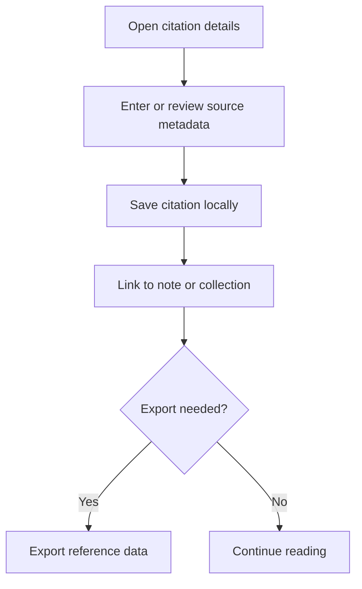

## UC-12 - Create a door between concepts

**Related story:** Story 12

**Actor:** User  
**Goal:** Record an explicit reason two concepts belong together.  
**Precondition:** At least two notes or collections exist.

**Main scenario:**
1. The user selects two or more items.
2. The user chooses **Create connection**.
3. The user describes the relationship.
4. Kiritori shows the connection in each selected context.
5. The user can later edit or remove the door without deleting the items.

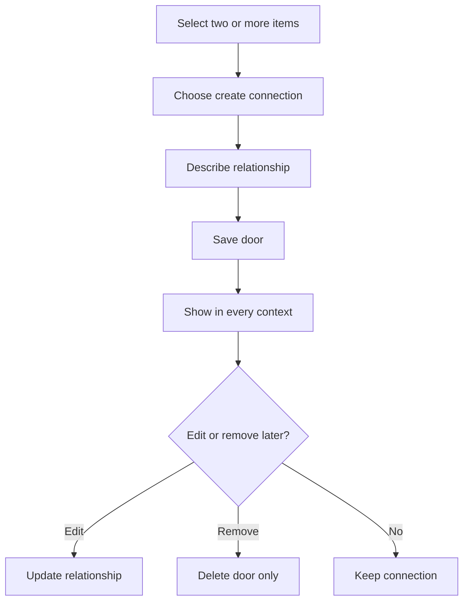

## UC-13 - Keep knowledge private

**Related story:** Story 13

**Actor:** User  
**Goal:** Use Kiritori without accounts, tracking, or remote storage.  
**Precondition:** Kiritori is installed locally.

**Main scenario:**
1. The user opens Kiritori without signing in.
2. Kiritori loads the local library.
3. The user creates, edits, and searches notes.
4. Data is written to local storage.
5. No cloud account or telemetry service is required.

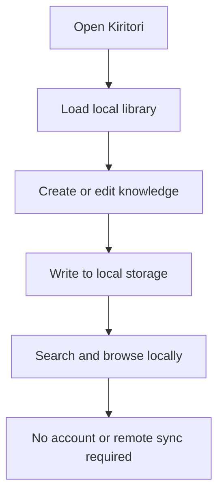

## UC-14 - Work offline

**Related story:** Story 14

**Actor:** User  
**Goal:** Continue using the knowledge garden without a network connection.  
**Precondition:** The library has previously been created or imported locally.

**Main scenario:**
1. The device loses connectivity.
2. The user captures, edits, imports, or browses notes.
3. Kiritori saves changes locally.
4. The user continues without an error state caused by the network.
5. Connectivity may return without changing the local data.

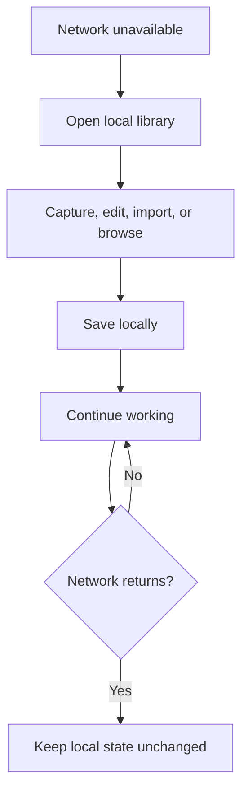

## UC-15 - Revisit an old note with context

**Related story:** Story 15

**Actor:** User  
**Goal:** Recover the meaning and surrounding context of earlier thinking.  
**Precondition:** The note exists in the local library.

**Main scenario:**
1. The user searches for or selects an old note.
2. Kiritori opens the note with its date and metadata.
3. The user views related collections and connections.
4. The user follows a related item or edits the note.
5. Kiritori preserves the updated context.

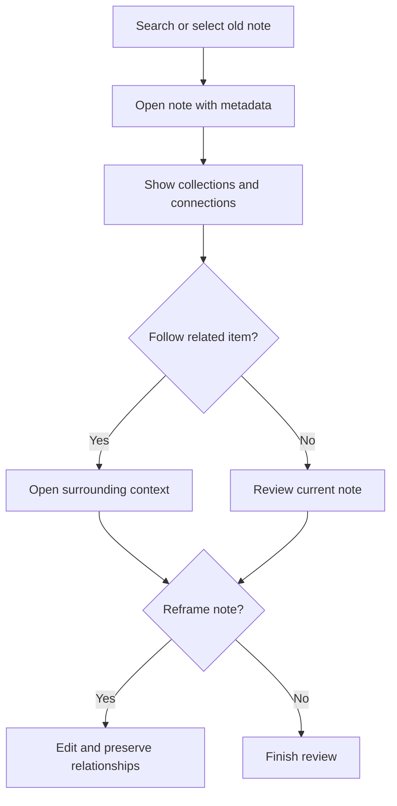

## UC-16 - Clean up the forest

**Related story:** Story 16

**Actor:** User  
**Goal:** Improve quality without losing control of the data.  
**Precondition:** The library contains notes that can be reviewed.

**Main scenario:**
1. The user opens cleanup suggestions.
2. Kiritori identifies orphaned, weakly connected, stale, or duplicate notes.
3. The user previews a suggestion.
4. The user reconnects, merges, archives, or deletes the item.
5. Kiritori updates the forest only after confirmation.

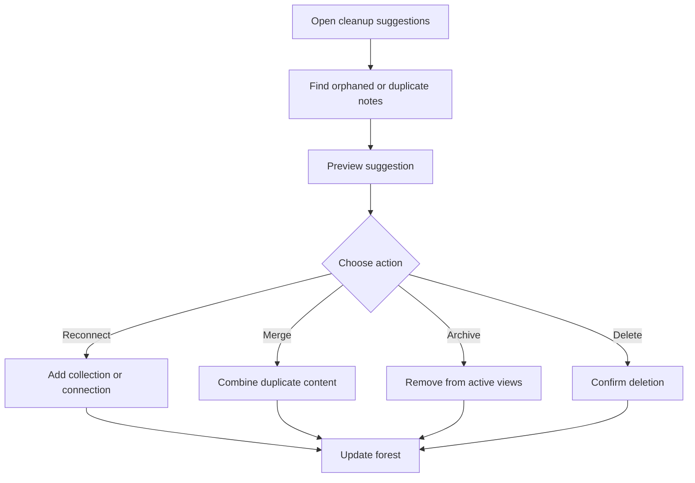

## UC-17 - Configure a calm working environment

**Related story:** Story 17

**Actor:** User  
**Goal:** Work for a sustained period without visual fatigue or distraction.  
**Precondition:** The user is viewing any main Kiritori surface.

**Main scenario:**
1. The user chooses a day, twilight, or night atmosphere.
2. Kiritori applies the theme without losing the current context.
3. The user changes density or layout if needed.
4. The user reads, captures, or explores notes.
5. Subtle transitions preserve orientation between views.

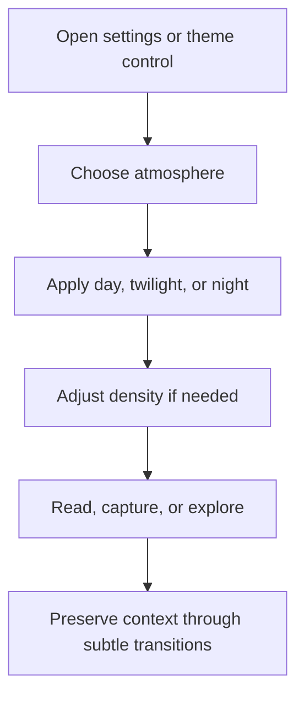

## UC-18 - Learn the forest mental model

**Related story:** Story 18

**Actor:** New or returning user  
**Goal:** Understand the structure well enough to act confidently.  
**Precondition:** Kiritori has opened to a library or starter state.

**Main scenario:**
1. The user sees clear distinctions between notes, collections, and connections.
2. Kiritori exposes the primary actions near the relevant content.
3. The user creates or opens a note.
4. The user follows its connection into a collection or neighbouring note.
5. The user can switch between capture and exploration without changing tools.

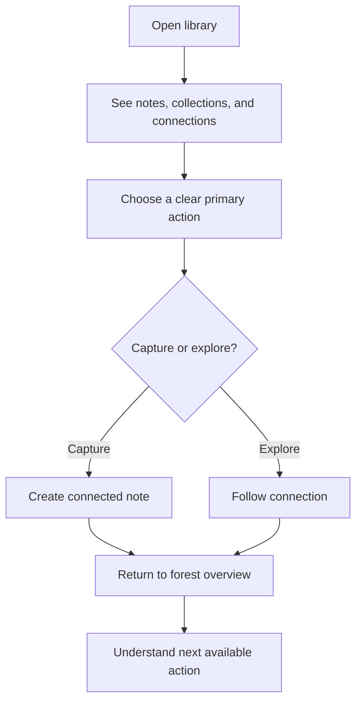

## Cross-cutting success conditions

Every use case should preserve the following behaviour:

- Changes are local-first and remain available offline.
- A note’s relationships are visible from the note and from its surrounding contexts.
- Destructive actions require deliberate confirmation.
- Users can recover from ordinary mistakes through undo, review, or restoration flows.
- The interface favours calm exploration while retaining enough density for serious review.

